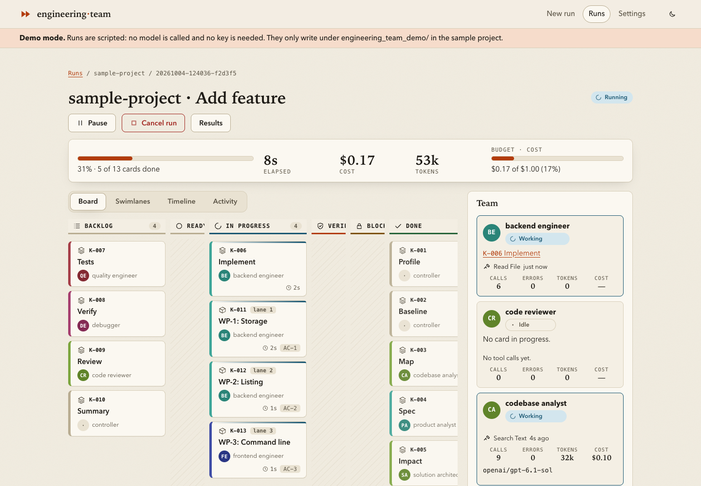

# Universal MVP Engineering Team

[](https://github.com/alexandre0sheva/crewai-engineering_team/actions/workflows/ci.yml)
[](LICENSE)


A reusable CrewAI project that turns a product request into a tested MVP in a
persistent, normal project directory. By default a staged, resumable pipeline of specialists
(`pipeline`) builds it; the 0.1.0 manager-led crew (`hierarchical`) and a one-agent baseline
(`single`) are still available. [What was measured](docs/BENCHMARKS.md#results-2026-10-04) decided the
default.

The team is stack-agnostic. It can build web apps, APIs, CLIs, automations, data
tools, mobile-oriented projects, or other small products when the required
runtime is available locally. The generated application can use any suitable
stack and a conventional nested project structure.

## Capabilities

- Product requests can come from a Markdown file, CLI argument, or environment
  variable.
- The `hierarchical` strategy (`--strategy hierarchical`, the 0.1.0 behaviour) has a custom
  `engineering_lead` manage a hierarchical CrewAI process and validate every task.
- Model tiers are explicit and configurable: flagship lead, lower-cost workers.
- Four stack-agnostic specialists cover architecture, backend, frontend, and
  quality.
- Six tasks cover architecture, foundation, backend/core, frontend/experience,
  verification, and release review.
- Generated projects use conventional nested files under
  `workspace/<project-name>/`.
- Workspaces persist across runs by default; reset is explicit.
- Filesystem tools prevent traversal and symlink escapes, and keep agents out of `.git` and
  the orchestrator's own `.engineering-team/` state.
- Command execution returns stdout, stderr, exit code, and timeouts; it uses no
  shell and strips secrets from child processes. `--sandbox docker` runs every command in a
  hardened container instead (no network except installs, only the project mounted; see
  [docs/SAFETY.md](docs/SAFETY.md#docker-backend)).
- Interim artifact guardrails require architecture, README, verification, and
  release documents to exist and contain real content before tasks can pass.
- Tracing and remote documentation MCPs are opt-in.

## Requirements

- Python 3.11–3.13 (CrewAI does not yet support 3.14)
- [uv](https://docs.astral.sh/uv/)
- An API key for the configured model provider
- Any language runtimes required by the MVP you ask the team to build

The supported CrewAI version range is declared in `pyproject.toml`.

## Setup

```bash
uv sync --group dev
cp .env.example .env
```

Add `OPENAI_API_KEY` to `.env`. Never commit `.env`.

Models, profiles, budgets, and every `ENGINEERING_*` variable are documented in
[docs/CONFIGURATION.md](docs/CONFIGURATION.md); `uv run engineering-team config show` prints what
is in effect and where each value came from. The default provider is OpenAI; Anthropic, Google,
Ollama, and Azure presets are available with `--provider` (or `provider = ...` in
`engineering-team.toml`). Keep the lead on your quality-first tier and workers on a balanced
lower-cost tier.

## Quick start

```bash
uv run engineering-team doctor                       # is this machine ready?
uv run engineering-team new --example tiny-notes     # a cheap bundled example
uv run engineering-team new --request-file my-idea.md --project-name my-idea
```

In a terminal you get a live view of the run: progress, the task board as a kanban, parallel lanes, and
cost against your budget. Steer it from another terminal with `board --watch`, `note`, `pause`, and
`cancel`; continue an interrupted run with `resume`. Everything, including exit codes, `--json` output,
and how to write a request the team can succeed with, is in [docs/USAGE.md](docs/USAGE.md).

Projects are created under `./workspace/<project-name>/`; reset is explicit (`--reset`) and only deletes
projects this tool created. The bundled example selects the lower-cost `smoke` profile (see
[docs/CONFIGURATION.md](docs/CONFIGURATION.md#models)), so a first run stays cheap.

The 0.1.0 form (`engineering-team --request-file FILE`) still works and prints a deprecation notice.

## Web UI

`uv sync --extra ui && uv run engineering-team ui` opens a local app at http://127.0.0.1:8765/ for starting runs,
watching them live (task board, teammates, activity, timeline, replay, steering) and reviewing the diff, criteria coverage and report; `ui --demo` tries it without an API key. See
[docs/USAGE.md](docs/USAGE.md#web-ui).



## Benchmarks

The team is measured, not assumed: a suite of greenfield and brownfield tasks judged by hidden
behavioural checks, with pass rates, confidence intervals and cost per success
(`engineering-team bench`; `bench run --fake` checks the harness offline). The method and threat
model are in [docs/BENCHMARKS.md](docs/BENCHMARKS.md).

First measured results (OpenAI `gpt-6` models, five dev tasks, two runs each; every number is in
[`benchmarks/results/2026-10-04/`](benchmarks/results/2026-10-04/)):

| Strategy | Passed | Cost per success (estimated) | Median time |
|----------|--------|------------------------------|-------------|
| `pipeline` (default) | 10/10 | $0.21 | 10.4 min |
| `single` (one agent, the baseline) | 9/10 | $0.0054 | 1.2 min |
| `hierarchical` (0.1.0) | 0/3 (all hit the 30-minute limit) | – | 30.2 min |

Ten runs per strategy cannot separate `pipeline` from `single` on pass rate (95 % intervals 72–100 %
and 60–98 %), and `single` costs far less on tasks this small. `pipeline` is the default because it
is the orchestrated strategy that finished the work (the 0.1.0 crew did not within 30 minutes) and
because it adds staged review and a controller-run verification report that the benchmark does not
score. Read the caveats in [docs/BENCHMARKS.md](docs/BENCHMARKS.md#limits-of-this-evaluation) before
quoting these.

## Generated project layout

Each MVP owns a conventional project root:

```text
workspace/
└── habit-tracker/
    ├── .engineering-team/
    │   └── runs/<run-id>/        # manifest, event log, request, logs per run
    ├── docs/
    │   ├── architecture.md
    │   ├── implementation-plan.md
    │   ├── verification.md
    │   └── release-report.md
    ├── README.md
    ├── src/ or apps/ or packages/
    ├── tests/
    └── stack-specific configuration
```

The exact source tree is chosen for the product and stack. Generated workspaces
are git-ignored by this orchestrator. A `pipeline` or `single` run makes a new project its own Git
repository (an initial commit, then one commit per finished stage; `--no-git` skips it); for other runs,
initialize a separate repository inside a finished MVP if you want to keep it.

## How orchestration works

This section describes the `hierarchical` strategy (`--strategy hierarchical`). The default,
`pipeline`, is described in [docs/ARCHITECTURE.md](docs/ARCHITECTURE.md#pipeline-recipes-and-resume).

CrewAI's hierarchical process gives the custom lead three responsibilities:

1. Assign each stage to the specialist best suited to the project state.
2. Supply context and reconcile decisions across specialists.
3. Validate task output and require rework when acceptance criteria or required
   artifacts are missing.

CrewAI 1.15 requires a custom hierarchical manager to start without ordinary
tools. The lead therefore receives CrewAI's scoped delegation and coworker tools,
while specialists receive the project filesystem, command, and optional
documentation tools. When the lead needs a file inspected or corrected, it
delegates that concrete action and evaluates the specialist's evidence.

The worker pool contains:

- `solution_architect`
- `backend_engineer`
- `frontend_engineer`
- `quality_engineer`

Tasks do not hardcode an assignee. This lets the lead route backend-free apps,
CLI products, integration-heavy automations, or unusual stacks intelligently
according to the requirements and current workspace state.

See [docs/ARCHITECTURE.md](docs/ARCHITECTURE.md) for boundaries and design
details.

## Filesystem and command safety

Agents work only inside the generated project: paths are relative and checked after symlink
resolution, `.git` and the orchestrator's `.engineering-team/` state are off limits, and
commands run without a shell from an executable allowlist with a scrubbed environment and a
timeout that kills the whole process tree. This reduces accidental damage; it is not a VM
boundary, so run the orchestrator in a container or VM for untrusted requests or dependencies.
See [docs/SAFETY.md](docs/SAFETY.md) for the full model and
[docs/TOOLS.md](docs/TOOLS.md) for every tool.

Add a required executable narrowly, and pass an environment variable to generated programs only
when necessary:

```dotenv
ENGINEERING_COMMAND_ALLOWLIST=just,flutter
ENGINEERING_SUBPROCESS_ENV_ALLOWLIST=DATABASE_URL
```

## Optional documentation tools

Remote MCP servers are disabled by default. To give specialist agents a
documentation server:

```dotenv
ENGINEERING_DOCS_MCP_URLS=https://your-trusted-server.example/mcp
```

Only configure servers you trust. They add latency, network access, and their
own data-handling boundary.

## Verification

Test and lint the orchestrator itself:

```bash
uv run pytest
uv run ruff check .
```

Validate CLI setup without an LLM call:

```bash
uv run engineering-team new --project-name smoke-test --prepare-only \
  --request "Build a CLI that stores and lists notes in a local JSON file."
```

An actual crew run consumes model tokens and may install dependencies selected
for the generated MVP. The quality and release stages record exact evidence in
the generated project's `docs/release-report.md`; in a pipeline run `docs/verification.md` is written by the
controller from checks it ran itself.

## CrewAI maintenance commands

Use these entry points for training, replay, and evaluation:

```bash
uv run train <iterations> <training-file> [request options]
uv run replay <task-id> --run <run-id>
uv run test <iterations> <evaluation-model> [request options]
```

CrewAI evolves quickly. Before changing CrewAI-specific code, check the installed
version, PyPI, changelog, and relevant live documentation as required by
[AGENTS.md](AGENTS.md).
