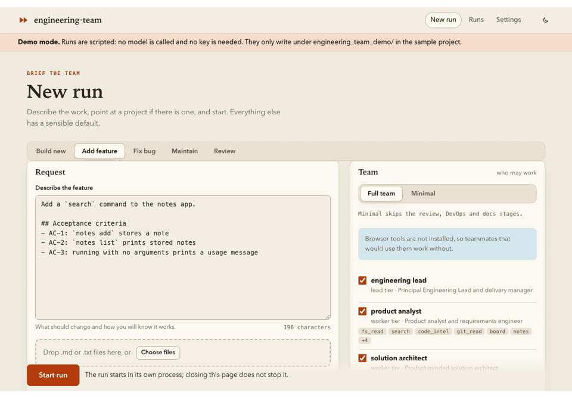
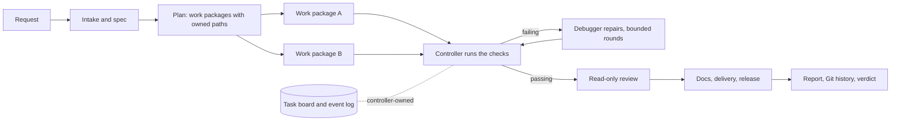

# Engineering Team

[](https://github.com/alexandre0sheva/crewai-engineering_team/actions/workflows/ci.yml)
[](LICENSE)


**A team of AI specialists that builds, changes and fixes software, and proves what it did:** a CrewAI
pipeline in which a controller, not the agents, runs the checks, moves the task board and decides what
counts as done.



*The web UI on a scripted run (`ui --demo`: the real pipeline and board, no model, no key). A terminal
recording of a live run is not committed yet; see [Try it without a key](#try-it-without-a-key).*

## What it does

| Mode | Command | Result |
|------|---------|--------|
| **new** | `engineering-team new` | A project from a request, in a Git repository of its own: spec, architecture, code, tests, docs |
| **feature** | `engineering-team feature` | A feature in an existing project, on a branch, checked against the project's own tests before and after |
| **fix** | `engineering-team fix` | A bug reproduced first (red), fixed, and shown fixed (green) |
| **maintain** | `engineering-team maintain` | Tests added, a refactor, dependency upgrades, docs, or a security audit |
| **review** | `engineering-team review` | A read-only review of a branch or diff, with `findings.json` for CI |
| **analyze** | `engineering-team analyze` | What an existing project is made of, and (with `--deep`) a codebase map |

Every run records a manifest, an event log, the task board and a self-contained HTML report you can open
or attach to a pull request. The team is stack-agnostic: it uses the runtimes you have installed.

## Install

You need Python 3.11–3.13, [uv](https://docs.astral.sh/uv/) and an API key for a model provider (OpenAI by
default; Anthropic, Google, Ollama and Azure are presets).

```bash
uv tool install --python 3.13 git+https://github.com/alexandre0sheva/crewai-engineering_team
# or: pipx install --python python3.13 git+https://github.com/alexandre0sheva/crewai-engineering_team
```

Pin the interpreter (3.11, 3.12 or 3.13): without `--python`, `uv tool install` can pick a newer Python
that CrewAI does not support yet, and the tool then fails on start. Once the package is on PyPI it will be
`uv tool install --python 3.13 engineering_team`. To work on the project itself, see
[CONTRIBUTING.md](CONTRIBUTING.md).

## Quickstart

```bash
export OPENAI_API_KEY=...                          # or put it in a .env file
engineering-team doctor                            # is this machine ready?
engineering-team new --example tiny-notes          # a cheap bundled example (the smoke profile)
engineering-team new --request-file my-idea.md --project-name my-idea
```

In a terminal you get a live view: progress, the task board as a kanban, parallel lanes and cost against
your budget. The project appears in `./workspace/my-idea/`. Steer a run from another terminal with
`board --watch`, `note`, `pause` and `cancel`; continue an interrupted one with `resume`.

Prefer a browser?

```bash
uv tool install --python 3.13 "engineering_team[ui] @ git+https://github.com/alexandre0sheva/crewai-engineering_team"
engineering-team ui                                # http://127.0.0.1:8765/
```

Start runs, watch them live (task board, teammates, activity, timeline, replay), steer them and review
the diff, the criteria coverage and the report. Commands, exit codes and how to write a request the team
can succeed with are in [docs/USAGE.md](docs/USAGE.md).

### Try it without a key

`engineering-team ui --demo` runs the real pipeline, board, checks and report with a **script instead of a
model**: every state of the dashboard shows up and nothing is billed. The [`examples/`](examples/) have
three scenarios (a new project, a feature on a legacy service, a bug fix) with their requests, the
outcome to expect, and a committed run report each. Those reports were produced the same scripted way, so
they show what a report looks like, not what a model writes.

## The team

Thirteen teammates, each with its own prompt, model tier and tool groups, all changeable in configuration
or YAML ([docs/TEAM.md](docs/TEAM.md)):

| Role | Teammates |
|------|-----------|
| Plan | `product_analyst` (specification), `solution_architect` (design and work split), `engineering_lead` (manages the 0.1.0 `hierarchical` crew) |
| Build | `backend_engineer`, `frontend_engineer`, `quality_engineer` (tests, release report), `devops_engineer`, `technical_writer`, `generalist_engineer` |
| Check | `code_reviewer`, `security_engineer` (read-only reviewers), `debugger` (reproduces failures and repairs) |
| Understand | `codebase_analyst` (explains an existing project) |

Add your own teammate, tool, MCP server or hook without changing the code
([docs/CONFIGURATION.md](docs/CONFIGURATION.md)).

## How it works



- **The controller decides.** Agents report; the controller runs the tests, linters and the project's own
  commands itself, writes `docs/verification.md` from what it saw, and is the only thing that moves a card to
  done. An agent's claim that it finished is a request for verification, not evidence.
- **Parallel without merging.** Work packages run side by side, each agent allowed to write only the paths
  its package owns, so there is nothing for a model to merge.
- **Resumable and bounded.** Stages are recorded, so a cancelled or failed run continues without redoing
  finished work, and budgets (cost, tokens, time, tool calls) stop a run that overspends.
- **Safe by default, sandbox on request.** Agents work inside the project, commands run without a shell from
  an allowlist with a scrubbed environment, the web and MCP are off until you enable them, and
  `--sandbox docker` runs every command in a hardened container.

Design, module map, run state and the alternatives that were rejected: [docs/ARCHITECTURE.md](docs/ARCHITECTURE.md).
The execution boundary and threat model: [docs/SAFETY.md](docs/SAFETY.md).

## Tools

Agents get a catalogue of structured tools rather than a shell: reading and searching, atomic multi-file
patches, test/lint/type-check/build runners that return parsed results, code intelligence (symbols,
references, importers, hotspots), read-only Git, background processes with an HTTP client, a headless
browser for UI checks, and, only when enabled, web search and fetching. Every tool, its group and its limits
are in [docs/TOOLS.md](docs/TOOLS.md).

## Measured, not assumed

A benchmark suite of greenfield and brownfield tasks, judged by hidden behavioural checks the team never
sees, decided the default strategy; pass rates come with confidence intervals and cost per success.
Method, threat model and every number: [docs/BENCHMARKS.md](docs/BENCHMARKS.md#results-2026-10-04) and
[`benchmarks/results/`](benchmarks/results/2026-10-04/). `engineering-team bench run --fake` checks the
harness offline.

## Limitations

- **Small samples.** The first evaluation is ten runs per strategy on small Python programs, one provider,
  one day. Its intervals are wide, it cannot separate the default pipeline from a single agent on pass rate
  (the single agent was far cheaper on tasks that small), and it does not score code quality, docs or
  review. [Read the caveats](docs/BENCHMARKS.md#limits-of-this-evaluation) before quoting a number.
- **Models are not deterministic**, and a live run costs real money. Set `budget.max_cost_usd` and use the
  `smoke` profile while you learn what a run costs ([docs/CONFIGURATION.md](docs/CONFIGURATION.md#budgets)).
- **The local backend is a project boundary, not a sandbox.** Use `--sandbox docker`, or a container or VM,
  for untrusted requests or dependencies. Plugins, MCP `command` servers and hooks run outside it by design.
- **Acceptance criteria are verified only when you say how**: without a checks file the report lists them
  as unverified and marks a test suite that merely mentions one as referenced.
- **Python 3.11–3.13.** CrewAI 1.15 itself declares `<3.14`.
- **0.2.0 is alpha.** Interfaces may still change before 1.0.

## Contributing and license

Issues and pull requests are welcome: [CONTRIBUTING.md](CONTRIBUTING.md) has the gate (the tests run offline,
no key needed), the testing helpers and the release process. Report vulnerabilities privately
([SECURITY.md](SECURITY.md)). Be kind: [Code of Conduct](CODE_OF_CONDUCT.md). Changes by version:
[CHANGELOG.md](CHANGELOG.md). MIT licensed ([LICENSE](LICENSE)).

Built on [CrewAI](https://docs.crewai.com/); coding assistants working on this repository should read
[AGENTS.md](AGENTS.md) first.
